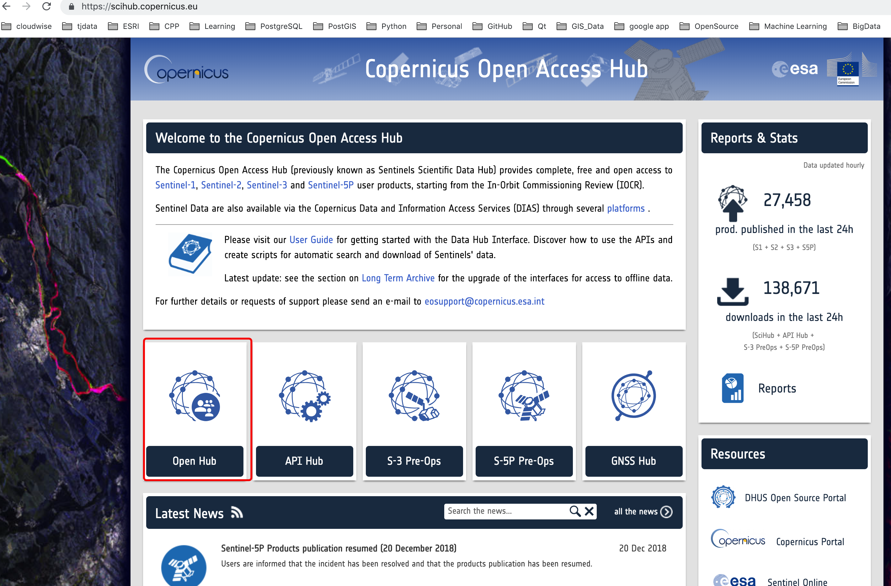
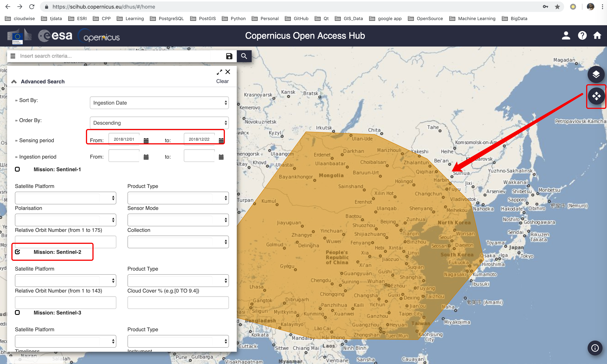
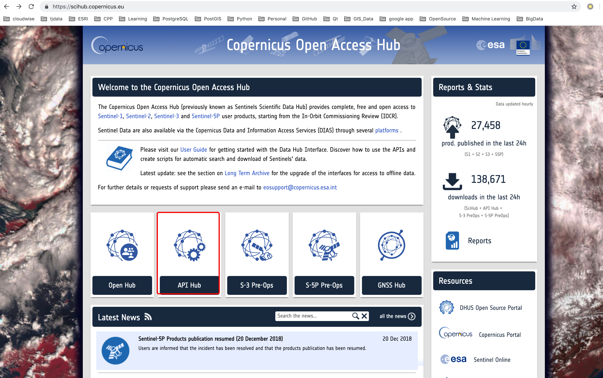

## 利用python下载哨兵2(sentinel 2)数据

近期由于在工作实验室要研究影像数据，所以需要下载欧空局（ESA）的哨兵2（sentinel 2）的再分析数据，本人通过官网上提供的API接口，对哨兵2（sentinel 2）数据进行批量下载。这种下载ECMWF数据的方法在[官网](https://confluence.ecmwf.int/display/WEBAPI/Access+ECMWF+Public+Datasets)上有非常详细的介绍。

### 注册账户并下载数据

1. 注册账户

  首先，我们需要注册一个欧空局（ESA）的账号，在[官网](https://scihub.copernicus.eu/)点击**Open Hub**,然后进行[注册](https://scihub.copernicus.eu/dhus/#/self-registration)，如下图所示，进行注册：

  

  

  在注册完成后，点击登陆即可，登陆后的界面如下图所示：

  

2. 设置查询条件

  如下图所示设置查询范围和条件，点击查询按钮进行查询：

  

3. 数据下载

  
  此时可以从查询后的结果中，选择需要的影像进行下载。


### 数据批量下载

1. API hub

  通过API hub可以实现数据的批量下载，如下图所示：

  

2. 安装sentinelsat

  ```
  pip install sentinelsat
  ```

3. 代码展示

  ```Python
  from sentinelsat.sentinel import SentinelAPI, read_geojson, geojson_to_wkt
  api = SentinelAPI('username', 'paswword', 'https://scihub.copernicus.eu/dhus')
  # search by polygon, time, and Hub query keywords
  footprint = geojson_to_wkt(read_geojson('map.geojson')) # 设置范围
  products = api.query(footprint,
                       date = ('20151219', date(2015, 12, 29)),
                       platformname = 'Sentinel-2',
                       cloudcoverpercentage = (0, 30))

  # download all results from the search
  api.download_all(products, outfolder, , checksum=False) # 此处checksum默认为True，本人在下载的时候出现问题，所以设置False
  ```

  更多信息，请查看[sentinelsat](https://github.com/sentinelsat/sentinelsat)
